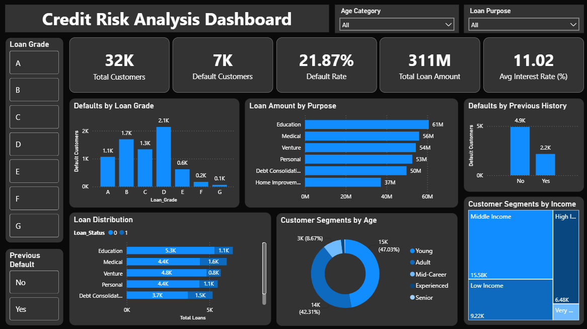

# Banking Credit Risk Analytics

A Data Analytics project analyzing 32,000+ loan records to identify default patterns and credit risk factors using Python, MySQL, and Power BI.

---

## About the Project

Banks face significant losses when borrowers default on loans. This project digs into a real-world lending dataset to understand **who defaults, why, and what risk factors drive defaults** — and presents the findings through SQL analysis and an interactive Power BI dashboard.

---

## Dataset

- **Files:** `raw_data.csv` (raw) → `cleaned_data.csv` (cleaned) → `final_data.csv` (with engineered features)
- **Records:** 32,000+ loan records after cleaning
- **Features:** Age, Income, Home Ownership, Employment Years, Loan Purpose, Loan Grade, Loan Amount, Interest Rate, Loan Status, Loan-to-Income Ratio, Previous Default, Credit History Years
- **Engineered Features:**
  - `Age_Category` — Young / Adult / Mid-Career / Experienced / Senior
  - `Income_Category` — Low Income / Middle Income / High Income / Very High Income
  - `Employment_Category` — New Employee / Early Career / Mid Career / Experienced
  - `Credit_History_Category` — New Credit User / Moderate Credit History / Established Credit / Long Credit History
  - `Loan_Size_Category` — Small Loan / Medium Loan / Large Loan / Very Large Loan
  - `Debt_Burden` — Low Burden / Moderate Burden / High Burden / Very High Burden
  - `Interest_Rate_Category` — Low Interest / Moderate Interest / High Interest / Very High Interest

---

## Workflow

1. Loaded raw dataset and checked shape, column types, missing values, and duplicates
2. Renamed columns to readable names
3. Removed invalid records — age above 100 and employment years exceeding age
4. Filled missing Employment Years using median imputation
5. Filled missing Interest Rates using loan grade-wise median (group-based imputation)
6. Created 7 new engineered features using `pd.cut()` for business-ready segmentation
7. Performed EDA — default rate by loan grade, debt burden analysis, income and age distributions
8. Exported cleaned and final datasets to CSV
9. Imported final CSV into MySQL and wrote SQL queries for detailed analysis
10. Built an interactive Power BI dashboard on the final dataset

---

## Tech Stack

- Python — Pandas, NumPy, Matplotlib
- MySQL
- Power BI

---

## Key Findings

- Out of 32K customers, **7K customers defaulted** — that is a **21.87% default rate**
- **Grade D loans** had the most defaults (2,100+) — highest risk among all loan grades
- **Education loans** had the highest total loan amount (61M) across all loan purposes
- Customers with **no previous default history** still made up 4,900+ defaults — meaning past record alone cannot predict risk
- **Adults (25–35 years)** were the largest customer group at 47% of total customers
- Average interest rate across all loans was **11.02%**

---

## SQL Queries Written

| Query | Description |
|-------|-------------|
| Total customers | Overall volume check |
| Default customers count | Core default metric |
| Default rate % | Overall KPI |
| Defaults by loan grade | Grade-wise risk breakdown |
| Customers by age category | Age segment distribution |
| Customers by income category | Income segment distribution |
| Loan distribution by purpose | Purpose-wise loan volume |
| Defaults by previous history | Impact of past default record |
| Ranking loan grades by defaults | RANK() window function |
| Ranking loan purposes by amount | DENSE_RANK() window function |
| Top risk loan grades (CTE) | Advanced query using CTE |

---

## Files

| File | Description |
|------|-------------|
| `notebooks/analysis.ipynb` | Python notebook — cleaning, feature engineering, EDA |
| `data/raw_data.csv` | Raw dataset |
| `data/cleaned_data.csv` | Cleaned dataset exported from Python |
| `data/final_data.csv` | Final dataset with all engineered features |
| `sql/credit_risk_analysis.sql` | All MySQL queries |
| `powerbi/Banking_Credit_Risk_Analytics.pbix` | Power BI dashboard file |

---

## Screenshots

